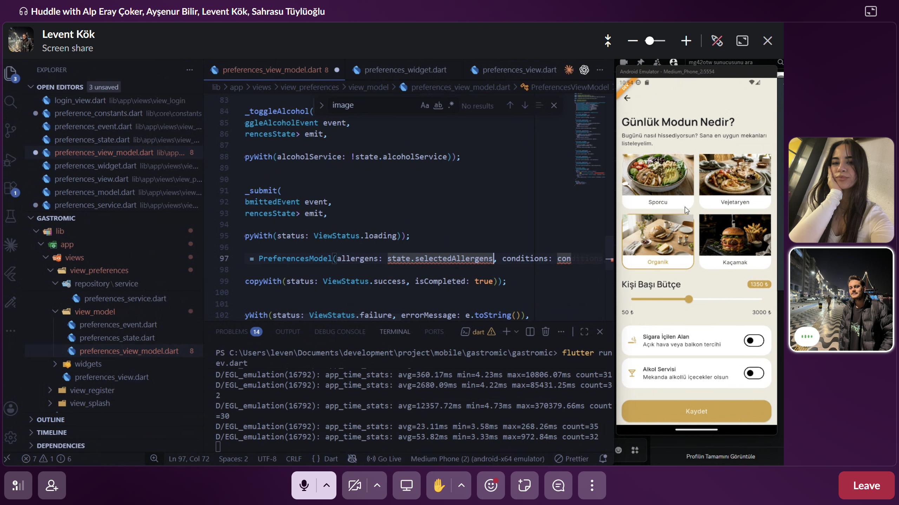
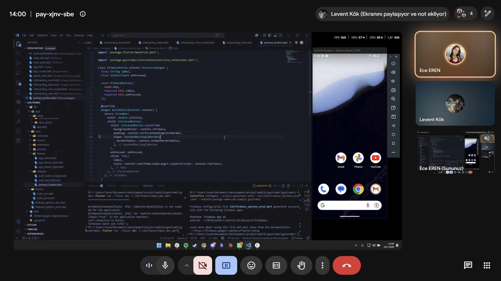
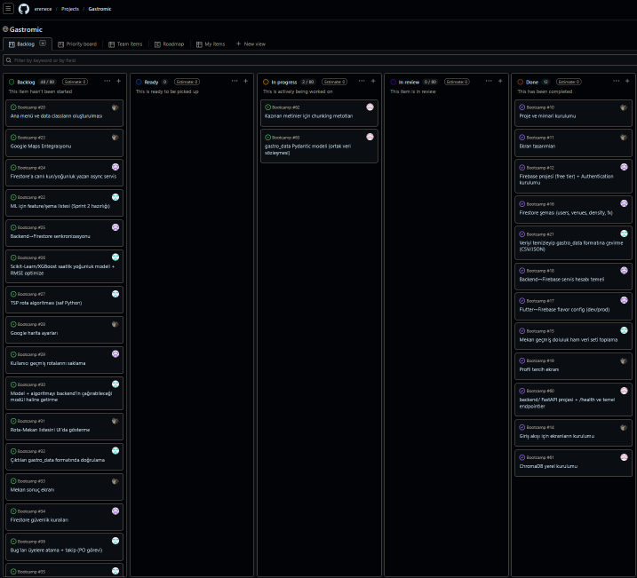
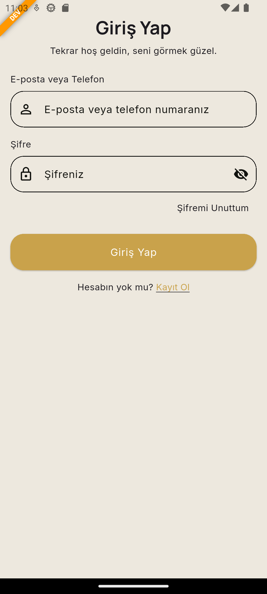
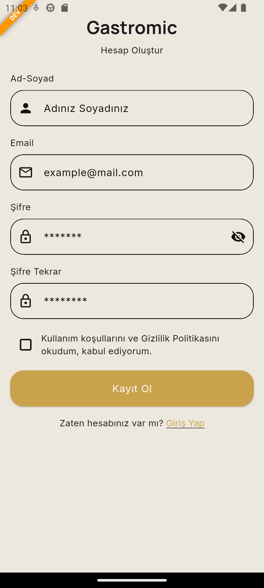
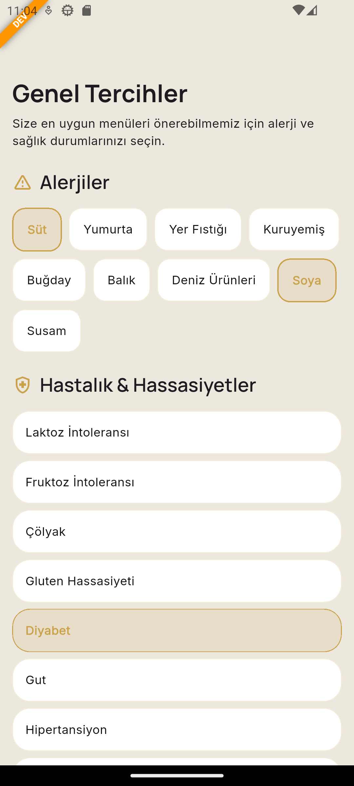
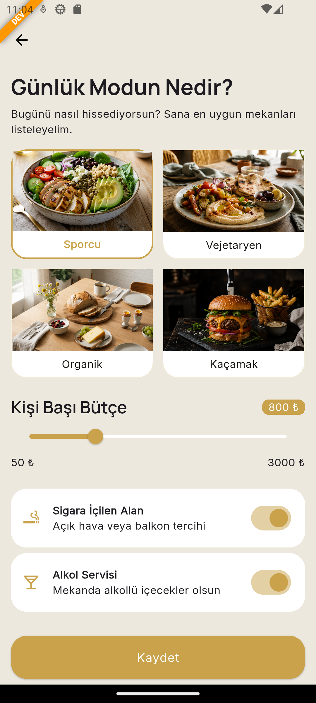
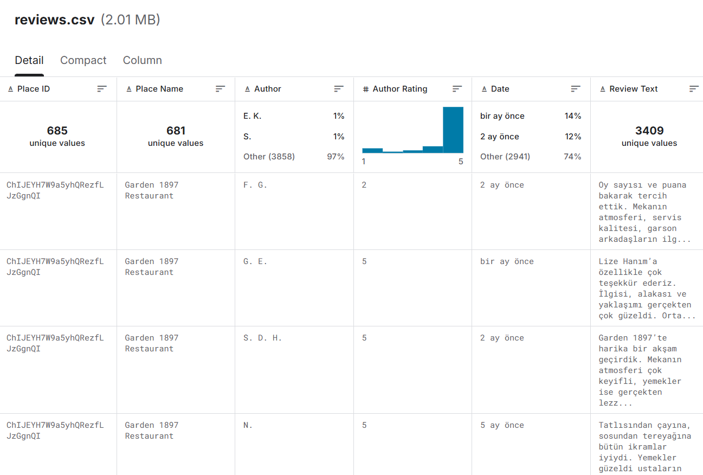
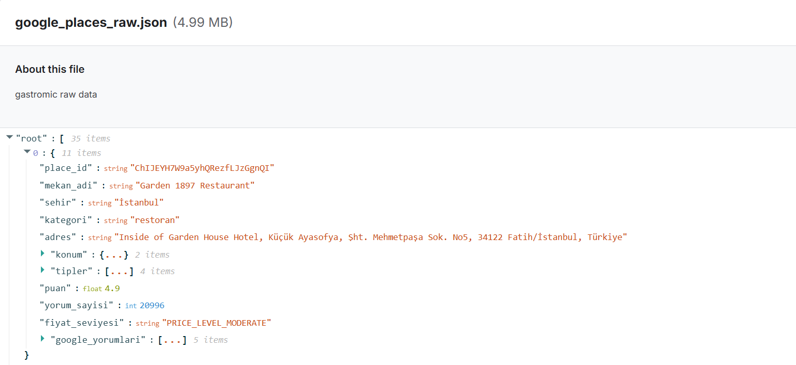

# **Takım İsmi**
Takım 119

# Ürün İle İlgili Bilgiler

## Takım Elemanları
- Ece EREN : Product Owner
- Levent KÖK : Scrum Master
- Sahrasu TÜYLÜOĞLU : Team Member/Developer
- Ayşenur BİLİR : Team Member/Developer
- Alp Eray ÇOKER : Team Member/Developer

## Ürün İsmi
**GASTROMİC**

## Ürün Açıklaması
GastroLogic AI (Gastromic), seyahat eden gurme gezginlerin bütçe, konum ve diyet/alerjen kısıtlamalarını (vegan, çölyak, laktoz intoleransı vb.) girdi olarak alan; topluluk verileriyle beslenen bir RAG (Retrieval-Augmented Generation) katmanı sayesinde "turist tuzağı" mekanları eleyen; coğrafi koordinat ve mekan çalışma saatlerini matematiksel optimizasyon algoritmalarıyla işleyerek kullanıcıya en verimli lezzet rotasını ve dijital rehberi sunan çapraz platform (cross-platform) bir mobil uygulamadır. Uygulamanın vitrini (frontend) tamamen mobil öncelikli olarak Flutter ile geliştirilmekte, arka plandaki yapay zeka katmanı ise asenkron mikro servisler aracılığıyla bu vitrini beslemektedir.

## Ürün Özellikleri
- Kullanıcıdan bütçe, konum ve diyet/alerjen bilgisi (vegan, çölyak, laktoz intoleransı, diyabet vb.) alarak kişiselleştirilmiş mekan önerisi sunma
- Topluluk verileri (Google Places, kullanıcı yorumları) ile beslenen RAG katmanı üzerinden "turist tuzağı" mekanların elenmesi
- Coğrafi koordinat ve mekan çalışma saatlerine göre matematiksel optimizasyon algoritmalarıyla en verimli rotanın hesaplanması
- "Günlük Mod" seçimiyle (Sporcu, Vejetaryen, Organik, Kaçamak) o anki ruh haline uygun mekan önerisi
- Kişi başı bütçe aralığı, sigara içilen alan ve alkol servisi gibi filtreleme seçenekleri
- E-posta/telefon ile kayıt ve giriş sistemi
- Cross-platform (Flutter tabanlı) mobil uygulama, arka planda asenkron mikro servis mimarisi

## Hedef Kitle
- Yurt içi/yurt dışı seyahat eden gurme gezginler
- Vegan, vejetaryen, çölyak, laktoz intoleransı gibi beslenme kısıtlaması olan bireyler
- Bütçesine uygun, turist tuzağı olmayan otantik mekan arayan kullanıcılar
- Spor/diyet takibi yapan, organik beslenmeyi önemseyen kullanıcılar
- 18-45 yaş arası, teknolojiye yatkın seyahat severler

## Product Backlog URL
[GastroLogic AI Product Backlog (GitHub Projects)](https://github.com/users/erenece/projects/2)

---

# Sprint 1

- **Backlog Dağıtma Mantığı**: Product backlog, GitHub Projects üzerinde öncelik sırasına göre (MoSCoW mantığıyla) organize edilmiştir. Sprint 1 kapsamına; kimlik doğrulama (giriş/kayıt), kullanıcı onboarding akışı, alerjen/hastalık tercihleri ekranı, günlük mod seçimi ile bütçe/filtre ayarları ve RAG katmanını besleyecek ham verinin (İstanbul restoranları) toplanması/temizlenmesi alınmıştır. Sprint başına tahmin edilen puanı aşmayacak şekilde, bir sonraki sprintte backend/AI entegrasyonuna temel oluşturacak story'ler seçilmiştir. Story'ler daha küçük task'lere bölünerek GitHub Projects board'unda takip edilmektedir.

- **Daily Scrum**: Daily Scrum toplantıları, takımın farklı görevlerde eş zamanlı çalışabilmesi için Google Meet üzerinden ekran paylaşımlı olarak gerçekleştirilmiştir. Toplantılarda önceki gün tamamlanan işler, gün içinde yapılacaklar ve önündeki engeller paylaşılmıştır. Örnek toplantı görüntüleri:
  - Ekran paylaşımlı pair-programming / Daily Scrum görüntüsü (primary_button.dart üzerinde çalışma)
  - Huddle üzerinden preferences_view_model.dart geliştirmesi ve uygulama önizlemesinin eş zamanlı incelenmesi

| Daily Scrum 1 | Daily Scrum 2 |
|---|---|
|  |  |

- **Sprint Board Updates**: Sprint board'daki task'ların büyük çoğunluğu "Done" veya "In Progress" durumuna taşınmıştır. Tamamlanan başlıca task'ler: giriş/kayıt ekranlarının UI kodlaması, onboarding akışının (splash + tanıtım ekranları) tamamlanması, kullanıcı tercihleri (alerjiler & hastalık/hassasiyet) ekranının geliştirilmesi, günlük mod ve bütçe/filtre ekranının geliştirilmesi, RAG için gerekli İstanbul restoran verisinin Google Places üzerinden toplanıp CSV/JSON formatına dönüştürülmesi.

| Sprint Board |
|---|
|  |

- **Ürün Durumu**: Sprint 1 sonunda uygulamanın mevcut durumu aşağıdaki ekranlarla özetlenebilir:
  - Onboarding / tanıtım ekranları ("Sana Özel Lezzet Rotası", "Keşfe Hazır mısın?")
  - Giriş Yap ve Kayıt Ol (Hesap Oluştur) ekranları
  - Genel Tercihler ekranı: alerjiler (süt, yumurta, yer fıstığı, kuruyemiş, buğday, balık, deniz ürünleri, soya, susam) ve hastalık/hassasiyet seçimi (laktoz intoleransı, fruktoz intoleransı, çölyak, gluten hassasiyeti, diyabet, gut, hipertansiyon)
  - Günlük Mod ekranı: Sporcu / Vejetaryen / Organik / Kaçamak modları, kişi başı bütçe kaydırıcısı (50₺–3000₺), sigara içilen alan ve alkol servisi filtreleri
  - RAG katmanını besleyecek ham veri: `google_places_raw.json` (İstanbul'daki restoranlara ait yer bilgisi, konum, puan, yorum sayısı, fiyat seviyesi), bu veriden türetilmiş `places.csv` (mekan bilgileri) ve `reviews.csv` (kullanıcı yorumları) veri setleri hazırlanmıştır.

**Mobil Uygulama Görüntüleri**

| Ürün Ekranı 1 | Ürün Ekranı 2 |
|---|---|
|  |  |

| Ürün Ekranı 3 | Ürün Ekranı 4 |
|---|---|
|  |  |

**Veri Seti Görüntüleri**

| Veri Seti 1 | Veri Seti 2 |
|---|---|
|  |  |

- **Sprint Review**: Sprint 1'de hedeflenen kullanıcı girişi/kaydı, onboarding akışı, tercih ve günlük mod ekranlarının UI tarafı tamamlanmıştır. Ayrıca RAG katmanı için gerekli olan İstanbul restoran verisi (mekan bilgisi + kullanıcı yorumları) toplanmış ve düzenlenmiştir. Backend/AI mikro servisleri ve rota optimizasyon algoritması henüz bu sprintte kapsanmamıştır; bu nedenle ilgili PBI'lar Sprint 2'ye aktarılmıştır. Geliştirilen ekranlarda kritik bir hata görülmemiş, sadece küçük UI/UX iyileştirmeleri not edilmiştir. Sprint Review katılımcıları: Ece EREN, Levent KÖK, Sahrasu TÜYLÜOĞLU, Ayşenur BİLİR, Alp Eray ÇOKER.

- **Sprint Retrospective**:
  - Frontend ve veri toplama (data scraping) görevlerinin paralel yürütülmesi verimli olmuştur, bu yaklaşımın Sprint 2'de de sürdürülmesine karar verilmiştir.
  - Task tahminlerinin (story point) bir kısmı gerçek süreden sapmıştır; Sprint 2 planlamasında tahminlerin daha detaylı task kırılımıyla yapılması kararlaştırılmıştır.
  - Backend/AI (RAG, optimizasyon algoritması) çalışmalarına Sprint 2'de daha erken başlanması ve bu alanda görev dağılımının netleştirilmesi gerektiği vurgulanmıştır.
  - Unit test yazımı için ayrılan efor bu sprintte yetersiz kalmıştır; Sprint 2'de test yazımına daha fazla zaman ayrılması kararlaştırılmıştır.

---

# Sprint 2

# Sprint 3
