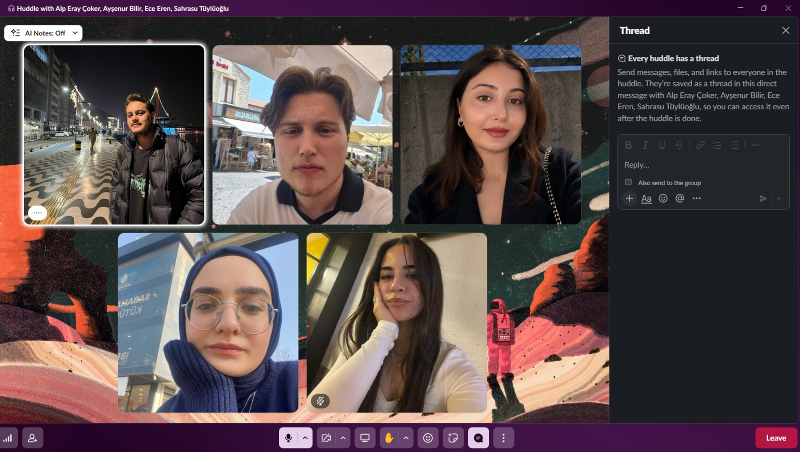
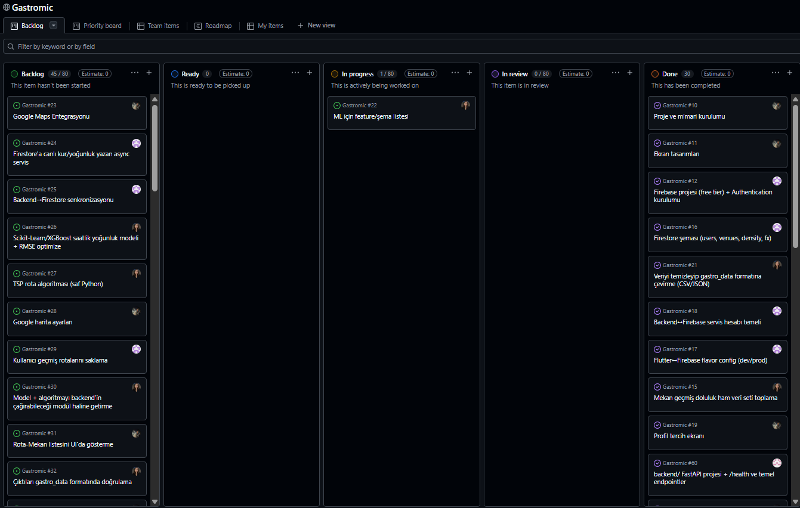
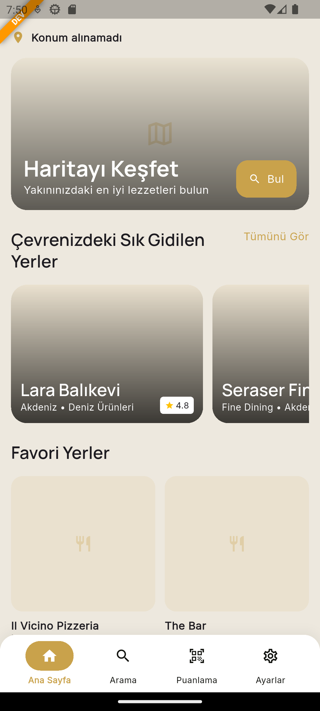
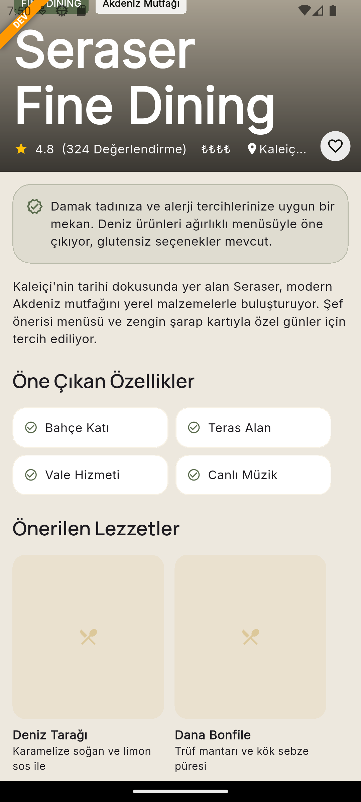
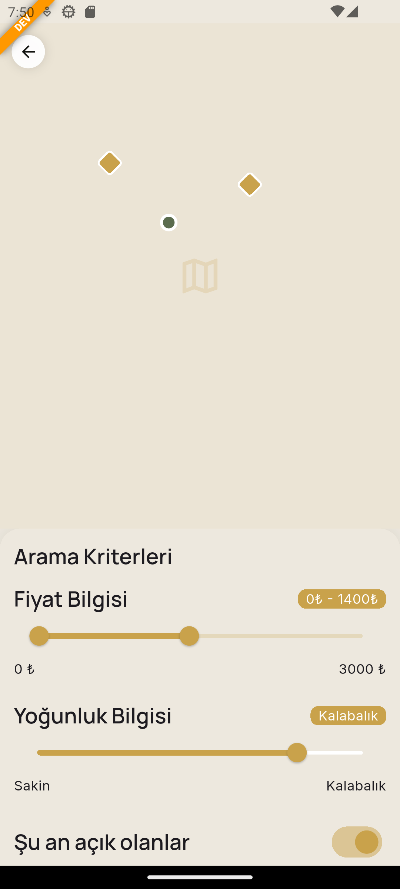
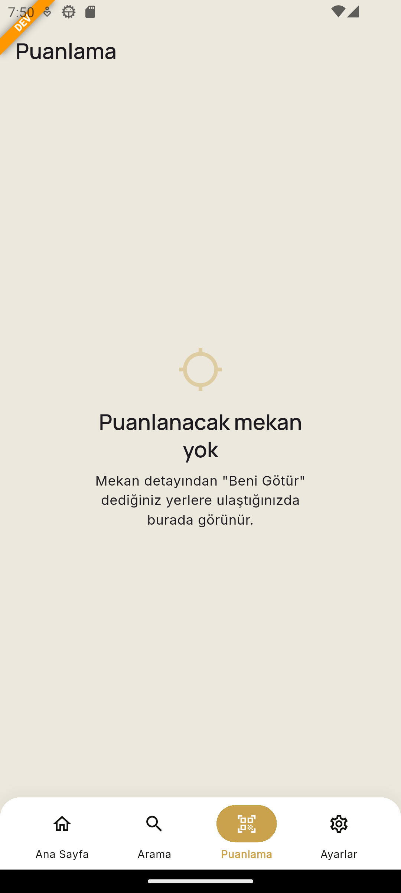
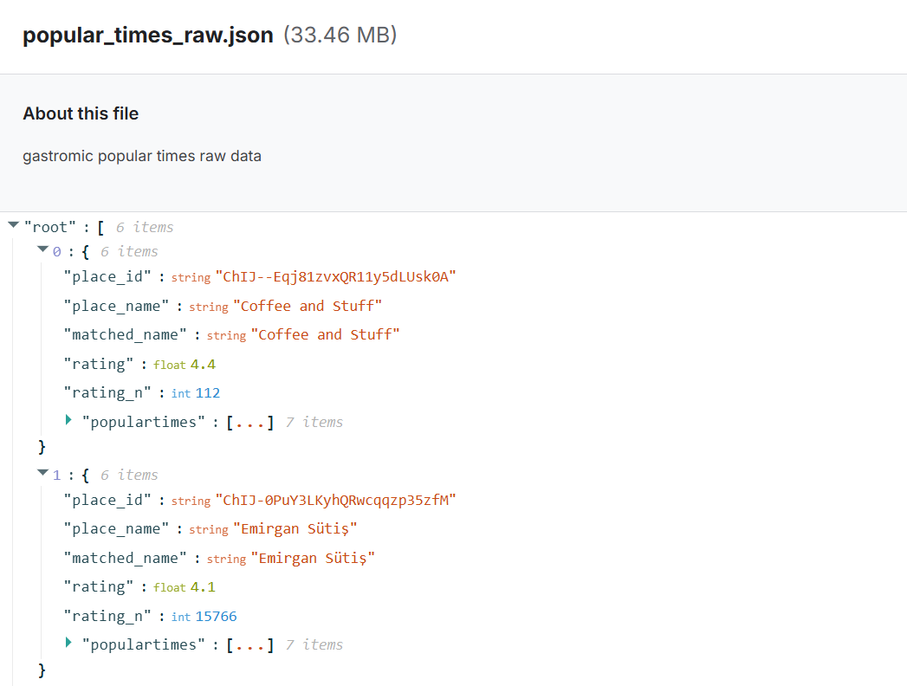
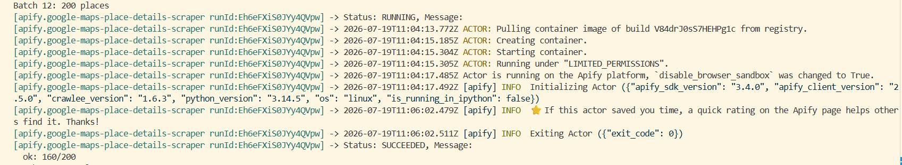
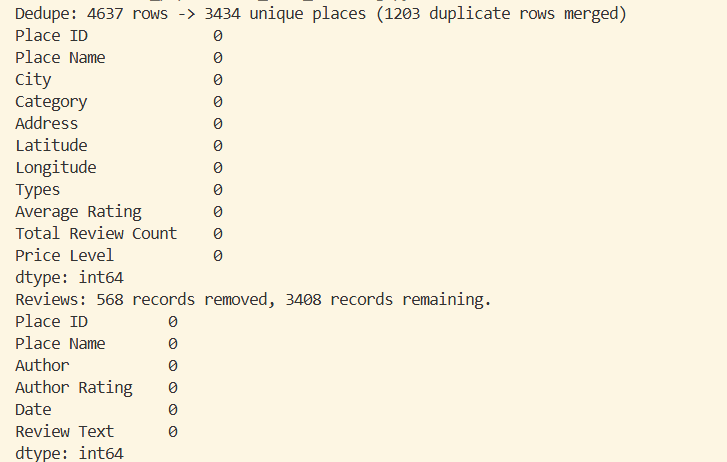
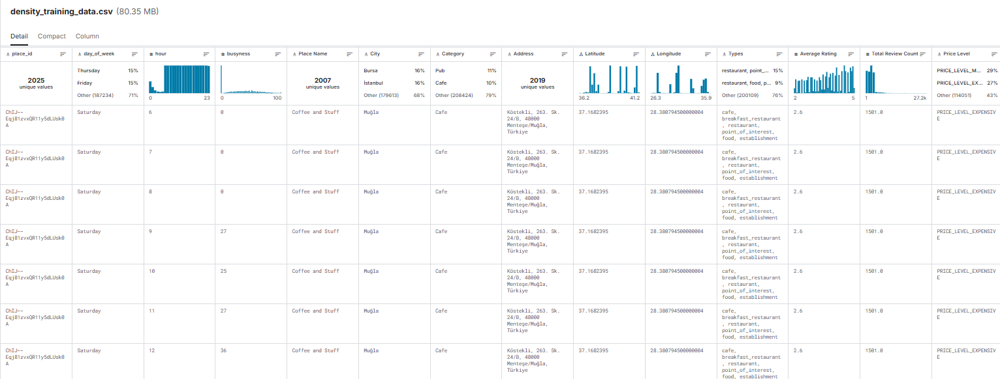

# **Takım İsmi**

Takım 119

# Ürün İle İlgili Bilgiler

## Takım Elemanları

- Ece EREN : Product Owner
- Levent KÖK : Scrum Master
- Sahrasu TÜYLÜOĞLU : Team Member/Developer
- Ayşenur BİLİR : Team Member/Developer
- Alp Eray ÇOKER : Team Member/Developer

## Ürün İsmi

**GASTROMİC**

## Ürün Açıklaması

Gastromic, seyahat eden gurme gezginlerin bütçe, konum ve diyet/alerjen kısıtlamalarını (vegan, çölyak, laktoz intoleransı vb.) girdi olarak alan; topluluk verileriyle beslenen bir RAG (Retrieval-Augmented Generation) katmanı sayesinde "turist tuzağı" mekanları eleyen; coğrafi koordinat ve mekan çalışma saatlerini matematiksel optimizasyon algoritmalarıyla işleyerek kullanıcıya en verimli lezzet rotasını ve dijital rehberi sunan çapraz platform (cross-platform) bir mobil uygulamadır. Uygulamanın vitrini (frontend) tamamen mobil öncelikli olarak Flutter ile geliştirilmekte, arka plandaki yapay zeka katmanı ise asenkron mikro servisler aracılığıyla bu vitrini beslemektedir.

## Ürün Özellikleri

- Kullanıcıdan bütçe, konum ve diyet/alerjen bilgisi (vegan, çölyak, laktoz intoleransı, diyabet vb.) alarak kişiselleştirilmiş mekan önerisi sunma
- Topluluk verileri (Google Places, kullanıcı yorumları) ile beslenen RAG katmanı üzerinden "turist tuzağı" mekanların elenmesi
- Coğrafi koordinat ve mekan çalışma saatlerine göre matematiksel optimizasyon algoritmalarıyla en verimli rotanın hesaplanması
- "Günlük Mod" seçimiyle (Sporcu, Vejetaryen, Organik, Kaçamak) o anki ruh haline uygun mekan önerisi
- Kişi başı bütçe aralığı, sigara içilen alan ve alkol servisi gibi filtreleme seçenekleri
- E-posta/telefon ile kayıt ve giriş sistemi
- Cross-platform (Flutter tabanlı) mobil uygulama, arka planda asenkron mikro servis mimarisi

## Hedef Kitle

- Yurt içi/yurt dışı seyahat eden gurme gezginler
- Vegan, vejetaryen, çölyak, laktoz intoleransı gibi beslenme kısıtlaması olan bireyler
- Bütçesine uygun, turist tuzağı olmayan otantik mekan arayan kullanıcılar
- Spor/diyet takibi yapan, organik beslenmeyi önemseyen kullanıcılar
- 18-45 yaş arası, teknolojiye yatkın seyahat severler

## Product Backlog URL

[GastroLogic AI Product Backlog (GitHub Projects)](https://github.com/users/erenece/projects/2)

---

# Sprint 1

- **Backlog Dağıtma Mantığı**: Product backlog, GitHub Projects üzerinde öncelik sırasına göre (MoSCoW mantığıyla) organize edilmiştir. Sprint 1 kapsamına; kimlik doğrulama (giriş/kayıt), kullanıcı onboarding akışı, alerjen/hastalık tercihleri ekranı, günlük mod seçimi ile bütçe/filtre ayarları ve RAG katmanını besleyecek ham verinin (İstanbul restoranları) toplanması/temizlenmesi alınmıştır. Sprint başına tahmin edilen puanı aşmayacak şekilde, bir sonraki sprintte backend/AI entegrasyonuna temel oluşturacak story'ler seçilmiştir. Story'ler daha küçük task'lere bölünerek GitHub Projects board'unda takip edilmektedir.

- **Daily Scrum**: Daily Scrum toplantıları, takımın farklı görevlerde eş zamanlı çalışabilmesi için Google Meet üzerinden ekran paylaşımlı olarak gerçekleştirilmiştir. Toplantılarda önceki gün tamamlanan işler, gün içinde yapılacaklar ve önündeki engeller paylaşılmıştır. Örnek toplantı görüntüleri:
  - Ekran paylaşımlı pair-programming / Daily Scrum görüntüsü (primary_button.dart üzerinde çalışma)
  - Huddle üzerinden preferences_view_model.dart geliştirmesi ve uygulama önizlemesinin eş zamanlı incelenmesi

| Daily Scrum 1                                                        | Daily Scrum 2                                                        |
| -------------------------------------------------------------------- | -------------------------------------------------------------------- |
|  |  |

- **Sprint Board Updates**: Sprint board'daki task'ların büyük çoğunluğu "Done" veya "In Progress" durumuna taşınmıştır. Tamamlanan başlıca task'ler: giriş/kayıt ekranlarının UI kodlaması, onboarding akışının (splash + tanıtım ekranları) tamamlanması, kullanıcı tercihleri (alerjiler & hastalık/hassasiyet) ekranının geliştirilmesi, günlük mod ve bütçe/filtre ekranının geliştirilmesi, RAG için gerekli restoran verisinin Google Places üzerinden toplanıp CSV/JSON formatına dönüştürülmesi.

| Sprint Board                                                           |
| ---------------------------------------------------------------------- |
|  |

- **Ürün Durumu**: Sprint 1 sonunda uygulamanın mevcut durumu aşağıdaki ekranlarla özetlenebilir:
  - Onboarding / tanıtım ekranları ("Sana Özel Lezzet Rotası", "Keşfe Hazır mısın?")
  - Giriş Yap ve Kayıt Ol (Hesap Oluştur) ekranları
  - Genel Tercihler ekranı: alerjiler (süt, yumurta, yer fıstığı, kuruyemiş, buğday, balık, deniz ürünleri, soya, susam) ve hastalık/hassasiyet seçimi (laktoz intoleransı, fruktoz intoleransı, çölyak, gluten hassasiyeti, diyabet, gut, hipertansiyon)
  - Günlük Mod ekranı: Sporcu / Vejetaryen / Organik / Kaçamak modları, kişi başı bütçe kaydırıcısı (50₺–3000₺), sigara içilen alan ve alkol servisi filtreleri
  - RAG katmanını besleyecek ham veri: `google_places_raw.json` (İstanbul'daki restoranlara ait yer bilgisi, konum, puan, yorum sayısı, fiyat seviyesi), bu veriden türetilmiş `places.csv` (mekan bilgileri) ve `reviews.csv` (kullanıcı yorumları) veri setleri hazırlanmıştır.

**Mobil Uygulama Görüntüleri**

| Ürün Ekranı 1                                                       | Ürün Ekranı 2                                                       |
| ------------------------------------------------------------------- | ------------------------------------------------------------------- |
|  |  |

| Ürün Ekranı 3                                                       | Ürün Ekranı 4                                                       |
| ------------------------------------------------------------------- | ------------------------------------------------------------------- |
|  |  |

**Veri Seti Görüntüleri**

| Veri Seti 1                                                     | Veri Seti 2                                                     |
| --------------------------------------------------------------- | --------------------------------------------------------------- |
|  |  |

- **Sprint Review**: Sprint 1'de hedeflenen kullanıcı girişi/kaydı, onboarding akışı, tercih ve günlük mod ekranlarının UI tarafı tamamlanmıştır. Ayrıca RAG katmanı için gerekli olan İstanbul restoran verisi (mekan bilgisi + kullanıcı yorumları) toplanmış ve düzenlenmiştir. Backend/AI mikro servisleri ve rota optimizasyon algoritması henüz bu sprintte kapsanmamıştır; bu nedenle ilgili PBI'lar Sprint 2'ye aktarılmıştır. Geliştirilen ekranlarda kritik bir hata görülmemiş, sadece küçük UI/UX iyileştirmeleri not edilmiştir. Sprint Review katılımcıları: Ece EREN, Levent KÖK, Sahrasu TÜYLÜOĞLU, Ayşenur BİLİR.

- **Sprint Retrospective**:
  - Frontend ve veri toplama (data scraping) görevlerinin paralel yürütülmesi verimli olmuştur, bu yaklaşımın Sprint 2'de de sürdürülmesine karar verilmiştir.
  - Task tahminlerinin (story point) bir kısmı gerçek süreden sapmıştır; Sprint 2 planlamasında tahminlerin daha detaylı task kırılımıyla yapılması kararlaştırılmıştır.
  - Backend/AI (RAG, optimizasyon algoritması) çalışmalarına Sprint 2'de daha erken başlanması ve bu alanda görev dağılımının netleştirilmesi gerektiği vurgulanmıştır.
  - Unit test yazımı için ayrılan efor bu sprintte yetersiz kalmıştır; Sprint 2'de test yazımına daha fazla zaman ayrılması kararlaştırılmıştır.

---

# Sprint 2

- **Sprint Notları**: Sprint 2'de takım iki ana kola ayrılarak paralel ilerledi: (1) Flutter tarafında Sprint 1'de tamamlanan tercih akışının sonrasındaki tüm ana ekranların (home, arama, mekan detay, puanlama, harita/operasyon) geliştirilmesi ve uygulamanın uçtan uca akışının (splash → onboarding/auth → tercihler → ana akış) bağlanması; (2) AI/veri tarafında yoğunluk verisinin toplanıp temizlenmesi ve çok ajanlı (multi-agent) AI beyninin (Profiler → RAG → Debate → Optimizer/TSP) kurulması. Sprint hedefleri GitHub Projects üzerinde MoSCoW önceliklendirmesiyle takip edilmiş, story'ler daha küçük task'lere bölünerek board üzerinde yönetilmiştir.

- **Puan Tamamlama Mantığı**: Proje genelinde toplam ~340 puanlık bir backlog öngörülmüş olup, üç sprinte dağıtılmıştır. Sprint 2 kapsamına, kullanıcının uygulama içinde uçtan uca gezinebileceği ana ekran akışının tamamlanması (frontend) ve AI katmanının çekirdeğini oluşturan çok ajanlı mimarinin kurulması (backend/AI) alınmış, bu doğrultuda 120 puan hedeflenmiştir. Backend/AI görevlerinin gerçek veri ve gerçek LLM ile doğrulanması bu sprintin en yoğun kısmını oluşturmuştur.

- **Daily Scrum**: Daily Scrum toplantıları Sprint 1'de olduğu gibi Google Meet üzerinden ekran paylaşımlı olarak sürdürülmüştür. Toplantılarda frontend ve AI/veri kollarının ilerlemesi eş zamanlı paylaşılmış, modüller arası bağımlılıklar (özellikle AI çıktısının frontend'i besleyeceği veri sözleşmesi) tartışılmıştır. Örnek Daily Scrum ve pair-programming görüntüleri:

| Daily Scrum 1                                                         |
| --------------------------------------------------------------------- |
|  |

- **Sprint Board Updates**: Sprint board'daki task'ların büyük çoğunluğu "Done" durumuna taşınmıştır. Tamamlanan başlıca task'ler; Flutter tarafında ana sayfa, arama, mekan detay, puanlama ve harita/operasyon ekranlarının geliştirilmesi, bottom navigation bar ile sekmeli navigasyon yapısının kurulması, splash yönlendirme ve kimlik doğrulama sonrası akış bağlantılarının tamamlanması; AI tarafında çok ajanlı mimarinin (Profiler → RAG → Debate → Optimizer/TSP) kurulması ve gerçek LLM/gerçek veri ile doğrulanması; veri tarafında ise yoğunluk (busyness) veri setinin toplanıp temizlenmesi ve eğitim verisinin oluşturulmasıdır.

| Sprint Board                                                           |
| ---------------------------------------------------------------------- |
|  |

## Sprint 2'de Yapılanlar (Üye Bazında)

### Flutter / Mobil Uygulama — Levent KÖK & Ece EREN

Sprint 1'de kimlik doğrulama ve tercih ekranları tamamlanmıştı. Sprint 2'de tercihler ekranından sonraki tüm ana akış geliştirildi ve uygulama uçtan uca gezilebilir hale getirildi:

- **Ana Sayfa (Home)**: Kullanıcının gerçek konumunu (geolocator + geocoding ile ilçe/şehir çözümlemesi) gösteren başlık, harita keşif kartı, "Çevrenizdeki Sık Gidilen Yerler" (yatay liste) ve "Favori Yerler" (grid) bölümleri geliştirildi.
- **Arama Ekranı**: Debounce'lu (yazmayı bırakınca tetiklenen, ek pakete bağımlı olmayan saf `dart:async` transformer'ı ile) canlı arama, son aramaların Hive ile lokal saklanması ve "Sık Ziyaret Edilen Yerler" bölümü geliştirildi.
- **Mekan Detay Ekranı**: Hero görsel + favori, AI özet kutusu, öne çıkan özellikler, önerilen lezzetler (dish-level öneri katmanı), değerlendirmeler ve konum/iletişim bölümlerinden oluşan detaylı ekran geliştirildi.
- **Puanlama Ekranı**: Kullanıcının "Beni Götür" ile işaretlediği mekanların konum eşleşmesine (100m yarıçap) göre listelendiği, aynı ekran içinde açılan yıldız + yorum formuyla değerlendirmelerin Firestore'a kaydedildiği akış geliştirildi.
- **Harita / Operasyon Ekranı**: Mekan pinleri ve kullanıcı konumunu gösteren harita alanı (placeholder), fiyat aralığı (0–3000₺), yoğunluk ve "şu an açık olanlar" kriterlerine göre **anlık (client-side) filtreleme** ve pine tıklandığında açılan mekan kartı geliştirildi.
- **Navigasyon ve Akış**: Custom tasarımlı bottom navigation bar (sekmeli `AutoTabsRouter` yapısı) kuruldu; splash ekranı kullanıcı durumuna göre (oturum + onboarding + tercih tamamlanma durumu) doğru ekrana yönlendirecek şekilde bağlandı; giriş/kayıt/tercih sonrası yönlendirmeler tamamlandı.
- Mimari olarak feature-first klasör yapısı, Bloc tabanlı state yönetimi ve mixin + `part` desenli widget yapısı korunarak tutarlılık sağlandı. Detaylar commit geçmişinden takip edilebilir.

### AI Agent Engineer — Alp Eray ÇOKER

Sprint 1'de CrewAI tabanlı ajan iskeleti (Profiler Agent, Gurme RAG Agent, Router/Supervisor stub) kuruldu. Sprint 2'de bu iskelet, gerçek LLM ve gerçek veri ile doğrulanan çalışan bir AI beynine dönüştürüldü:

- **Çok ajanlı zincir**: Profiler → RAG → Agent Debate → Optimizer/TSP akışı tek hatta zincirlendi; ajanlar 3 iterasyonluk müzakere (debate) ile **filtreleme → puanlama → uzlaşma** yaparak her hamleyi gerekçesiyle loglar.
- **Deterministik + LLM ayrımı (kritik mimari karar)**: Alerjen vetosu, bütçe hesabı ve rota **bilerek deterministik** bırakıldı; LLM bu kısımlara karışmıyor. Sebep: bir dil modeli halüsinasyonla alerjen sızdırırsa (ör. çölyak hastasına glutenli öneri) bu bir **sağlık riski**. Gemini yalnızca elde edilmiş, doğrulanmış sonucu doğal dile (GastroPass rehberi) çeviriyor; belge başına tek LLM çağrısı ile token-ekonomik tutuldu.
- **Gerçek veriyle bulunan ve düzeltilen 5 kritik hata**: Bunların en kritiği, LLM'in "burada glutensiz seçenek var" diye uydurma bilgi üretmesiydi — guardrail sıkılaştırılarak modelin kısıtı şefe teyit ettirmesi sağlandı. Ayrıca alerjen vetosunun gerçek veride tetiklenmemesi (çift dilli anahtar kelime taraması ile çözüldü), "glutensiz" substring tuzağı (`"gluten"` ⊂ `"glutensiz"`), Gemini free-tier kota hatası ve token kesilmesi sorunları giderildi.
- **Kalite korumaları**: Rota kapağı (`MAX_ROUTE_STOPS`), Bayes büzülmesiyle puan enflasyonu koruması (`adjusted_rating`) ve hermetik testler (gerçek veri seti olsun olmasın aynı sonucu veren) eklendi.
- **Ölçümler (gerçek veriyle)**: 3434 mekan / 7 şehir havuzu, 500 İstanbul mekanında 23 alerjen vetosu (0 hatalı veto), 34 vegan mekanda 0 yanlış-pozitif, 30 test yeşil. Detaylar `ai_pipeline` klasörü ve ilgili README'de yer almaktadır.

### Veri / ML — Sahrasu TÜYLÜOĞLU

Sprint 2'de saatlik yoğunluk (busyness) modeli için gerekli veri seti hazırlandı ve mevcut veri temizlendi:

- **Veri temizleme**: Aynı `place_id`'ye sahip tekrar eden kayıtlar temizlendi, mekan kategorileri birleştirildi ve yorumlar (reviews) verisi düzenlendi.
- **Yoğunluk modeli denemeleri**: Saatlik yoğunluk ML modeli için önce Google Places API'den yoğunluk verisi çekilmeye çalışıldı; alınamayınca `livepopulartimes` kaynağı denendi (başarısız oldu, ilgili kod kaldırıldı). Ardından yorumlardan NLP ile yoğunluk sinyali çıkarılıp model geliştirildi, ancak veri yetersizliği nedeniyle model beklenen başarıyı vermediği için NLP ve model yaklaşımı iptal edildi.
- **Nihai veri seti**: Yoğunluk verisi Apify üzerinden, `places.csv` içindeki `place_id`'lere denk gelecek şekilde JSON formatında çekildi; temizlendikten sonra `places.csv` ile birleştirilerek yoğunluk modelinin eğitim verisi olan **`density_training_data.csv`** oluşturuldu. Bu veri seti, bir sonraki sprintte yoğunluk tahmin modelinin eğitimine temel oluşturacaktır.

## Ürün Durumu

Sprint 2 sonunda uygulama, kullanıcı girişinden başlayarak tercih seçimi, ana sayfa, arama, mekan detay, konum bazlı puanlama ve harita/filtre ekranları arasında uçtan uca gezilebilir durumdadır. AI tarafında ise çok ajanlı öneri motoru gerçek veri ve gerçek LLM ile çalışır hale getirilmiştir. Aşağıdaki ekran görüntüleri Sprint 2 sonundaki durumu özetlemektedir:

**Mobil Uygulama Görüntüleri**

| Ürün Ekranı 1                                                       | Ürün Ekranı 2                                                       |
| ------------------------------------------------------------------- | ------------------------------------------------------------------- |
|  |  |

| Ürün Ekranı 3                                                       | Ürün Ekranı 4                                                       |
| ------------------------------------------------------------------- | ------------------------------------------------------------------- |
|  |  |

**AI / Veri Görüntüleri**

| AI Çıktısı / Veri Seti 1                                          | AI Çıktısı / Veri Seti 2                                               |
| ----------------------------------------------------------------- | ---------------------------------------------------------------------- |
|  |  |

| AI Çıktısı / Veri Seti 1                                      | AI Çıktısı / Veri Seti 2                                        |
| ------------------------------------------------------------- | --------------------------------------------------------------- |
|  |  |

- **Sprint Review**: Sprint 2'de hedeflenen ana ekran akışının (frontend) uçtan uca tamamlanması ve AI beyninin (çok ajanlı öneri motoru) gerçek veri/gerçek LLM ile çalışır hale getirilmesi başarıyla gerçekleştirilmiştir. Frontend ve AI kolları paralel ilerlemiş, aralarındaki veri sözleşmesi (contracts) netleştirilmiştir. Frontend tarafında ekranlar şu an mock/placeholder veri ile çalışmakta olup, gerçek AI çıktısıyla ve gerçek görsellerle backend entegrasyonu Sprint 3'e planlanmıştır. Sprint Review katılımcıları: Ece EREN, Levent KÖK, Sahrasu TÜYLÜOĞLU, Ayşenur BİLİR, Alp Eray ÇOKER.

- **Sprint Retrospective**:
  - Frontend ve AI/veri görevlerinin paralel yürütülmesi bu sprintte de verimli olmuş, akışın uçtan uca tamamlanması takımın motivasyonunu artırmıştır.
  - AI tarafında "gerçek veriyle test etme" yaklaşımı, birim testlerin yakalayamadığı 5 kritik hatayı (özellikle sağlık riski oluşturan alerjen/glutensiz hatalarını) ortaya çıkardığı için çok değerli bulunmuş, Sprint 3'te de gerçek veriyle doğrulamanın sürdürülmesine karar verilmiştir.
  - Modüller arası bağımlılığın (AI çıktısı → frontend) erkenden bir veri sözleşmesiyle (contracts) tanımlanmasının entegrasyonu kolaylaştıracağı vurgulanmıştır; Sprint 3'te frontend'in gerçek backend'e bağlanması önceliklendirilmiştir.
  - Yoğunluk modeli için veri toplama sürecinin beklenenden uzun sürmesi (başarısız kaynak denemeleri), Sprint 3'te model eğitimine ayrılacak sürenin daha gerçekçi tahmin edilmesi gerektiğini göstermiştir.
  - Backend servislerinin (FastAPI) frontend ile entegrasyonu ve unit test kapsamının artırılması Sprint 3'e taşınmıştır.

# Sprint 3
